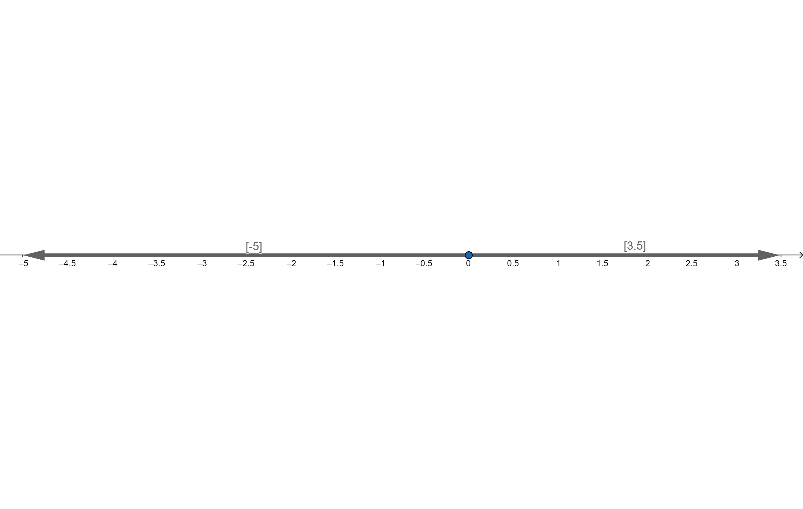
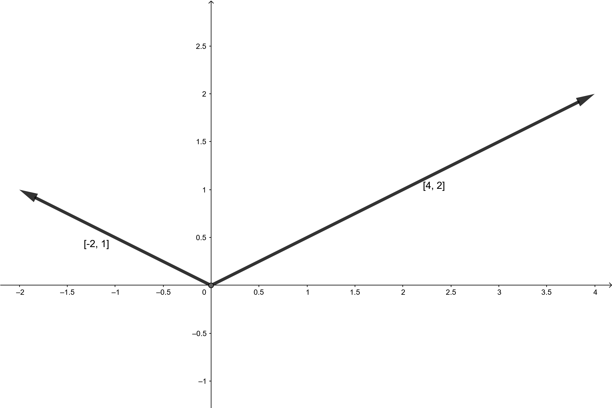
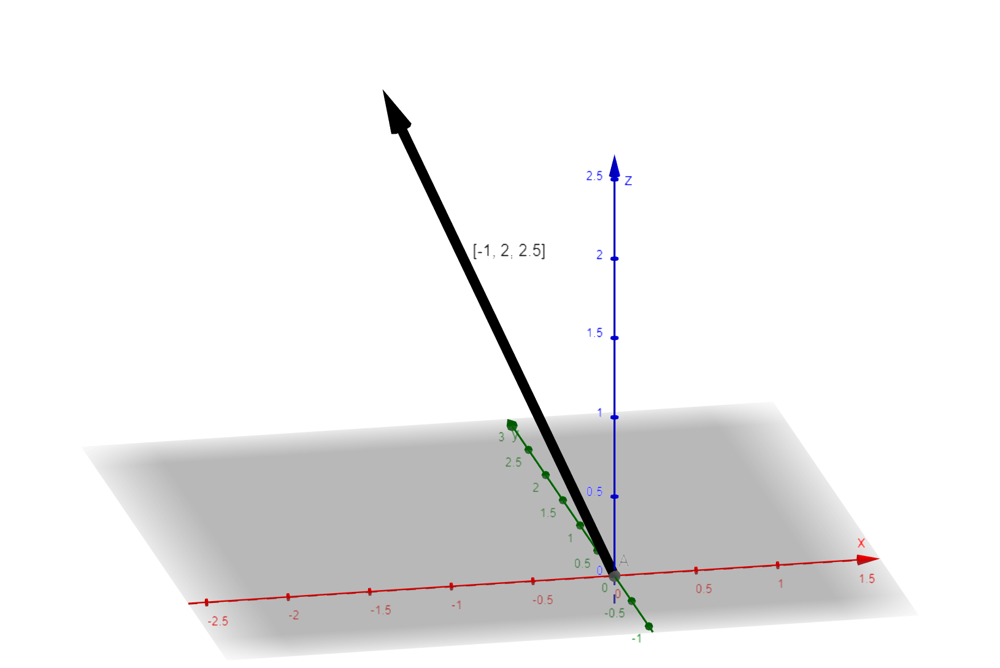
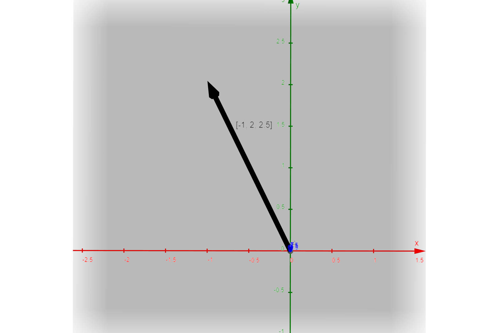
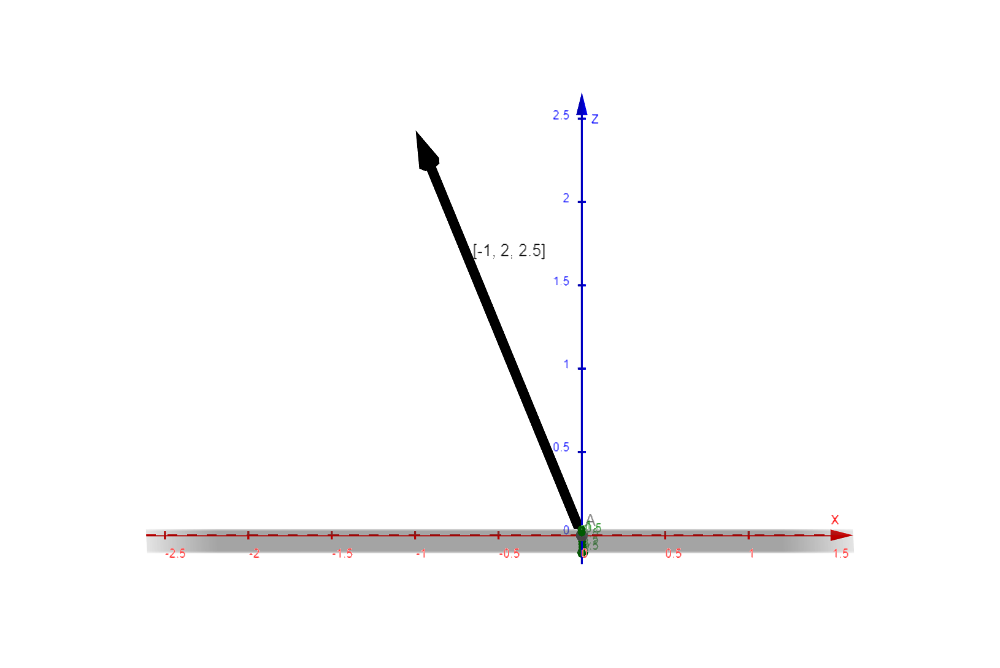
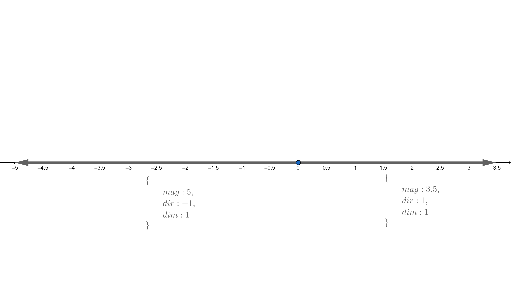
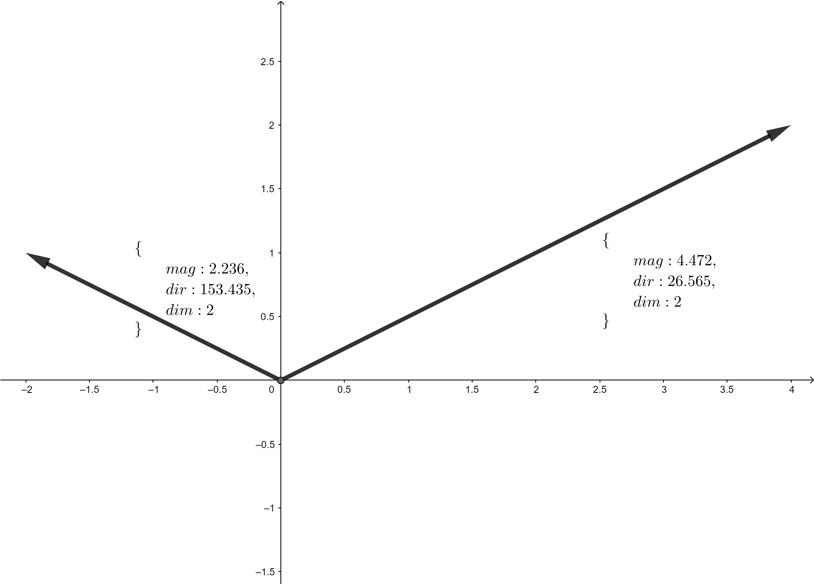
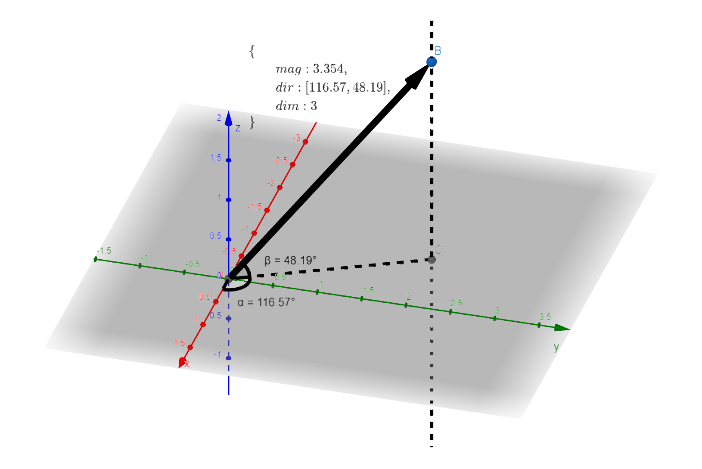
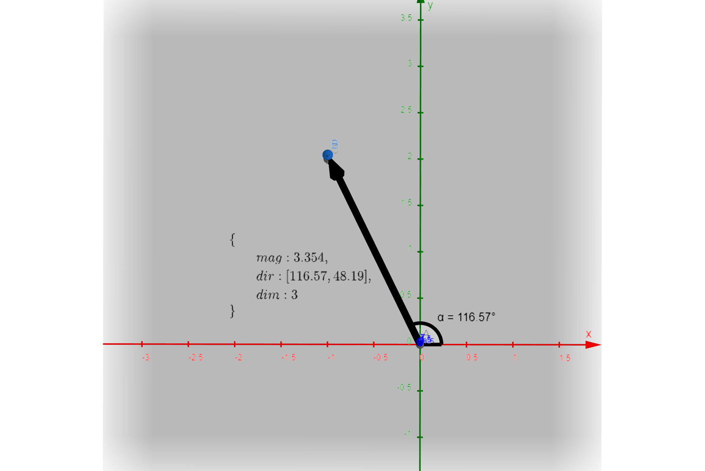
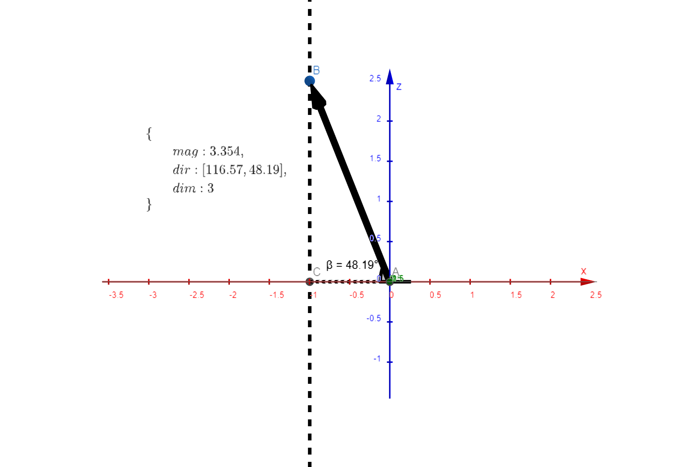

# vector-js
Simple 1d-3d vector library supporting angular and component forms.

# Vector types
A vector can be in either two forms - component or angular.

## Component Vector (VectorCom)
Vector is stored as a list of numbers.
### 1d Vector
```ts
[number]
```


### 2d Vector
```ts
[number, number]
```


### 3d Vector
```ts
[number, number, number]
```


Top View



Side View



## Angular Vector (VectorAng)
Vector is stored as an object with three properties:
- `mag` for magnitude
- `dir` for direction
- `dim` for dimension

### 1d Vector
```ts
{
    mag: number, // mag >= 0
    dir: -1 | 1, // -1 for negative and 1 for positive direction
    dim: 1
}
```


### 2d Vector
```ts
{
    mag: number, // mag >= 0
    dir: number, // angle in degrees within (-180, 180]
    dim: 2
}
```


### 3d Vector
```ts
{
    mag: number, // mag >= 0
    dir: [number, number], // two angles in degrees within (-180, 180]
    dim: 3
}
```

First angle α of `dir` is on the x-y horizontal plane. It's the angle of the vector's projection onto the x-y plane. Second angle β of `dir` is along the z axis. It's the angle between the vector and its projection onto the x-y plane.



Top View



Side View



# Vector Operations

To indicate which form to produce the resultant vector, use `VectorForm` flag which can be either `"com"` for component or `"ang"` for angular. Form defaults to `"com"` for component vectors.

## decomposeVector(v: Vector): VectorCom
Break a vector into its components.

## angularizeVector(v: Vector): VectorAng
Convert a vector into its angular form - magnitude and direction.

## addVectors(vs: Vector[], form: VectorForm): Vector
Add two vectors in the same dimension to produce a resultant vector in `form` (`"ang"` or `"com"`).

## negateVector(v: Vector, form: VectorForm): Vector
Negate a vector's direction to produce a resultant vector in `form`.

## subtractVectors(v1: Vector, v2: Vector, form: VectorForm): Vector
Subtract v2 from v1 (v1 - v2) to produce a resultant vector in `form`. v1 and v2 must be in the same dimension.
